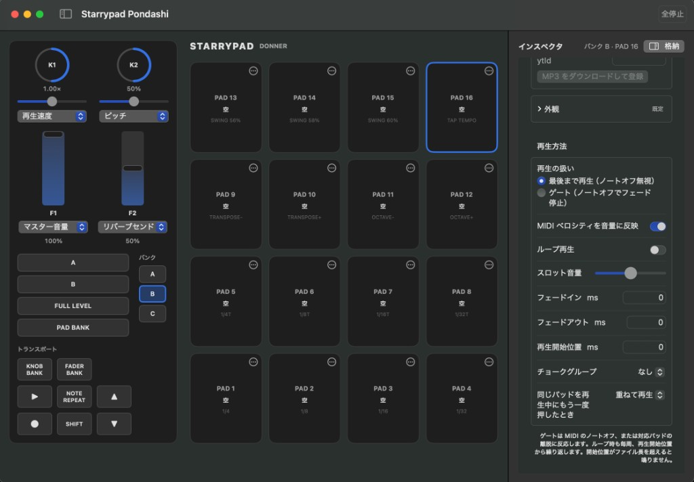

# Starrypad Pondashi

`Starrypad Pondashi` は、macOS 向けの DONNER Starrypad に特化したサンプラーパッドアプリです。  
MIDI パッドコントローラーからノート / CC を受け取り、48 スロット（3 バンク × 16 パッド）のサンプル再生を行います。

## 主な機能

### サンプルとパッド

- 48 スロットのサンプル管理（3 バンク × 16 パッド）
- パッドごとの詳細設定（インスペクタ）
  - ループ再生
  - フェードイン / フェードアウト
  - 再生開始位置（ms）
  - チョークグループ
  - ノートオフ追従（ゲート）
  - ベロシティ感度
  - 再トリガー動作（重ねる / 停止 / フェード停止 / 再スタート）
  - スロット音量（**再生中でもスライダーでリアルタイム反映**）
  - セル背景色・表示名
- パッド間ドラッグ&ドロップ
  - 通常ドロップ: 置き換え（移動）
  - `Option` + ドロップ: 複製
- YouTube URL からの音声取り込み（空スロット向け、`yt-dlp` が必要）

### 音声エンジン

- 信号経路: ボイス → メイン → タイムピッチ → コンプ → リバーブ → ディレイ → **3 バンド EQ** → 出力
- マスター音量、PAN、ピッチ、再生速度、エフェクトセンド等

### フェーダー / ノブ（左パネル・MIDI）

- フェーダー / ノブに役割を割り当て可能
- マスター、PAN、コンプ、ピッチ、再生速度、リバーブ / ディレイ関連
- **ノブ専用**: バス音量（追加）、**LOW / MID / HIGH のカット・ブースト**（シェルフ / パラメトリック、中央がフラット）

### MIDI マッピングとハードウェア

- **設定**で MIDI ソース・チャンネル、各コントロールの**学習（キャプチャ）**
  - パッド（バンク A / B / C）
  - フェーダー / ノブ（CC）
  - **トランスポート系ボタン**（ノートまたは **CC**）
    - 全停止、バンク次 / 前、**再生 / 一時停止**（実機が CC で送る場合にも対応）
    - **A / B ボタン**（プロファイルの `buttons[4]` / `buttons[5]`）
- プリセット（キット）側で **A / B ボタンの動作**を選択
  - **次のパッドを予約**: ボタンを押したままパッドを指定し、**離したとき**に既存ボイスをフェードアウトしてから切り替え（クロスフェード的な切り替え）
  - **全停止（panic）**
  - **スタッター**: 押している間、短い間隔で再生位置を戻してリピート感を出す
- Program Change やバンクスイッチによるバンク切替
- プロファイル JSON のエクスポート、および Application Support への保存

### UI

- 左パネル: ノブ・フェーダー・バンク・**再生 / 一時停止**（再生中のみ有効）
- パッドグリッド: 再生中ハイライト、**キュー予約中**のスロットは緑枠
- 設定: 音声出力デバイス（システム既定 / 個別デバイス）

### データ

- プリセット（キット）保存 / 読込（JSON）

## 動作環境

- macOS 13.0 以降
- Xcode（Swift 5）

## 起動方法

1. このリポジトリを取得
2. `StarrypadPondashi.xcodeproj` を Xcode で開く
3. ターゲット `StarrypadPondashi` を選択して実行

## 基本的な使い方

1. **MIDI 入力を選択**  
   アプリの「設定」タブで MIDI ソースとチャンネルを指定します。
2. **パッドに音声を割り当て**  
   - パッドをクリックしてインスペクタを開き「音声を割当…」  
   - または Finder から音声ファイルをドラッグ&ドロップ
3. **再生・調整**  
   パッドクリックまたは MIDI ノート入力で再生し、インスペクタや左パネルから挙動・音量・EQ 等を調整します。再生中にインスペクタのスロット音量を変えると、その場で音量が変わります。
4. **ハードのボタン**  
   設定の「マッピングキャプチャ」で、停止・バンク・再生/一時停止・A/B などを実機に合わせて学習します。A/B の役割はキット設定のピッカーで選びます。
5. **必要に応じて保存**  
   「設定」タブからプリセット保存 / 読込、プロファイル保存を行います。

## 保存データの場所

アプリは主に以下へデータを保存します（`~/Library/Application Support/StarrypadPondashi` 配下）。

- `Samples/` : 取り込んだ音声ファイル
- `Presets/` : プリセット関連データ
- `Profiles/` : 保存した MIDI プロファイル

## 付属プロファイル

- `StarrypadPondashi/Resources/StarrypadDefault.json`
  - 初期マッピング定義（パッドノート、フェーダー / ノブ CC、各種ボタン、バンク切替など）。実機に合わせて設定のキャプチャで上書きすることを推奨します。

## 開発メモ

- UI: SwiftUI
- MIDI: CoreMIDI
- Audio: AVAudioEngine / AudioUnit（Dynamics、Reverb、Delay、**EQ** 等）
- テストターゲットは現状未作成です。
